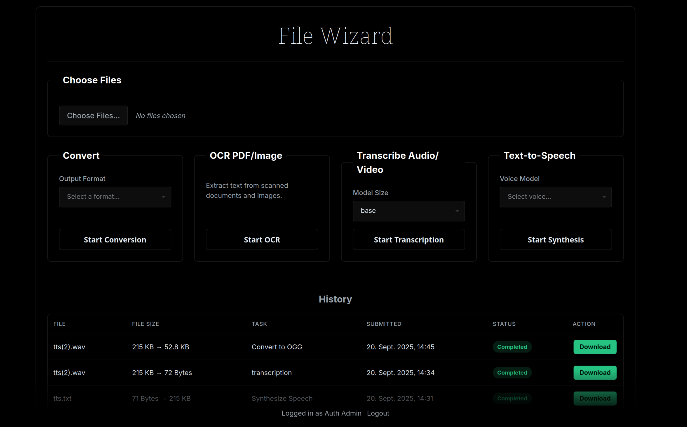

# File Wizard

File Wizard is a self-hosted, browser-based utility for file conversion, OCR, and audio transcription. It wraps many cli and python converters aswell as fast-whisper and tesseract ocr.



## Features
  *  Convert between various file formats. The system is designed to be extended with any command-line tool (like FFmpeg, ImageMagick, etc.) via a simple `settings.yml` configuration file.
  * **OCR:** Perform Optical Character Recognition on PDFs and images to extract text.
  * **Audio Transcription:** Transcribe audio files into text using Whisper models.
  * **UI:**
      * Clean, responsive, dark-themed interface (hopefully goodlooking idk)
      * Drag-and-drop support for single or multiple files anywhere on the screen, File selection Dialogue 
  * **Real-time Updates & History:**
      * Jobs are processed in the background, with the UI updating statuses in real-time.
      * A persistent job history
     
  * **Configuration:**
[See the Wiki](https://github.com/LoredCast/filewizard/wiki)

      * A dedicated `/settings` page.
      * OAuth needs to be configured in the `config/settings.yml` file, you can see the default for a reference. By default, it runs without auth in local mode.
      * Currently it only supports cpu operations, but a future image will include the cuda drivers for running whisper on gpu (torch and cuda is large and I didn't want to inflate the image even more)

-----

## NOTE
Run at your own risk! This app is highly vulnerable to arbitrary code executing if left public and without auth. I'm no security expert this app is intended for local use or usage with an OAuth oidc provider!

## Tech Stack:
FastAPI for the Server, Vanilla html, js, css for the frontend (might switch to svelte in the future, kept it light for this), Huey for task queuing and SQlite for any Databse.

-----

## Installation & Setup 

### With Docker (Local Build)
Clone the Repo and make sure docker compose is working on your environment

```bash
git clone https://github.com/LoredCast/filewizard.git
cd filewizard
```

Startup Docker, initially the settings.yml file is applied, you can edit it.
For You can edit the .env file for further configuration.

Note: Building this image will take some time installing all deps ((mostly texlive)).

```bash
docker compose up --build
```


### With Docker (From Dockerhub) [Recommended]
I've published 4 images to dockerhub that you can pull:

- `loredcast/filewizard:0.2`
- `loredcast/filewizard:0.2-small`

and the previous images without tts:
- `loredcast/filewizard:latest`
- `loredcast/filewizard:small`

The smaller one has Tex and many large tools left out.

Copy the `docker-compose.yml` from the repo into a directory on your machine, adjust the file to your needs and startup docker.

```bash
docker compose up -d
```


### Manually


**1. Clone the Repository**

```bash
git clone https://github.com/LoredCast/filewizard.git
cd filewizard
```

**2. Create a Virtual Environment & Install Dependencies**

```bash
python -m venv venv
source venv/bin/activate  # On Windows, use `venv\Scripts\activate`

# Make sure you have a requirements.txt file with all dependencies
pip install -r requirements.txt
```

*(**Note:** Dependencies include `fastapi`, `uvicorn`, `sqlalchemy`, `huey`, `faster-whisper`, `ocrmypdf`, `pytesseract`, `python-multipart`, `pyyaml`, etc.)*

**3. Configure the Application**
Copy the default settings file and customize it to your needs. This is where you define your conversion tools and other parameters.


**4. Run the Web Server**
This command starts the Webserver and Huey.

```bash
chmod +x run.sh
./run.sh
```


-----

## Usage 

1.  Open your browser to `http://127.0.0.1:8000`.
2.  **Drag and drop** any file or multiple files onto the page.
3.  A dialog will appear asking you to choose an action: **Convert**, **OCR**, or **Transcribe**.
4.  Alternatively, use the "Choose File" buttons in any of the three sections.
5.  Your job will appear in the "History" table, and its status will update automatically.

# Toollist


| Tool | From (accepted inputs — extensions / format names) | To (outputs — extensions / format names) |
|---|---|---|
| LibreOffice (soffice) | .odt, .fodt, .ott, .doc, .docx, .docm, .dot, .dotx, .rtf, .txt, .html, .htm, .xhtml, .xml, .sxw, .wps, .wpd, .abw, .pdb, .epub, .fb2, .lit, .lrf, .pages, .wps, .csv, .tsv, .xls, .xlsx, .xlsm, .ods, .sxc, .123, .dbf, .ppt, .pptx, .pps, .odp, image imports (.png, .jpg, .jpeg, .bmp, .gif, .tiff), .pdf (openable) | .pdf, .pdfa, .odt, .fodt, .doc, .docx, .rtf, .txt, .html/.htm, .xhtml, .epub, .svg (from Draw/Impress), .png (export raster), .jpg/.jpeg (export raster), .pptx, .ppt, .odp, .xls, .xlsx, .ods, .csv, .dbf, .pdb, .fb2 |
| Pandoc | Input format names / typical extensions: .md (markdown / gfm / commonmark), .markdown, .mdown, .txt (md), .html/.htm, .latex/.tex, .rst (.rst), docx (.docx), odt (.odt), epub (.epub), ipynb (Jupyter .ipynb), opml (.opml), asciidoc (.adoc), textile, mediawiki, jira, man/roff (.man), docbook (.xml), BibTeX/CSL JSON, fb2 etc. | Output format names / mapped extensions: .html/.html5, .xhtml, .latex/.tex, .pdf (via engine like pdflatex/xelatex/lualatex), .docx, .odt, .epub/.epub2/.epub3, .md (various flavors), .gfm, .rst, .pptx, .beamer (PDF via LaTeX), .man, .mediawiki, .docbook (.xml), .tex |
| Ghostscript (gs) — PDF/PS/rasters | Inputs: .ps, .eps, .pdf, PostScript streams | Outputs: .pdf (various compatibility levels incl PDF/A), .ps/.eps (PostScript), raster images: .png, .png16m, .pngalpha, .jpg/.jpeg, .tif/.tiff (including tiffg4), .bmp, .pcx, .pnm/.pbm/.pgm/.ppm, plus many device names (see Ghostscript devices) — build-dependent |
| Calibre (ebook-convert) | .epub, .mobi, .azw3, .azw, .azw4, .kfx (limited), .fb2, .html, .htmlz, .docx, .doc, .rtf, .txt, .pdb, .lrf, .lit, .tcr, .pdb, .prc, .cbz, .cbr, .chm, .djvu (if supported), .odt, .pdf (input possible but fidelity varies) | .epub, .mobi (old), .azw3 (Kindle), .pdf, .docx, .rtf, .txt, .fb2, .htmlz, .pdb, .lrf, .lit, .tcr, .cbz, .cbr (archives), (note: some outputs like mobi/azw may be deprecated or limited) |
| FFmpeg (ffmpeg) — very large / build-dependent | Common container & audio/video/image inputs: .mp4, .m4v, .mkv, .mov, .avi, .webm, .flv, .wmv, .mpg/.mpeg/.vob, .ts, .m2ts, .3gp, .3g2, audio: .mp3, .wav, .aac/.m4a, .flac, .ogg, .opus, .wma, .aiff, .amr, image sequences (.png, .jpg, .jpeg, .tiff, .bmp), HLS/streams (.m3u8), raw streams — extensive list (see ffmpeg -formats) | Similar huge set as inputs for outputs: containers & codecs: .mp4, .mkv, .mov, .webm, .avi, .flv, .mp3, .aac/.m4a, .wav, .flac, .ogg, .opus, .gif (animated), .ts, .h264 elementary streams and many others. FFmpeg supports 100+ demuxers/muxers & codecs; exact set is build-dependent. |
| libvips (vips) | .jpg/.jpeg, .png, .tif/.tiff, .webp, .avif, .heif/.heic, .jp2 (JPEG2000), .gif (frames), .pnm (.pbm/.pgm/.ppm), .fits, .exr, .pgm, .pfm, .csv (for bands), .v/.vips, PDF (via poppler delegate) — build-dependent | .jpg/.jpeg, .png, .tif/.tiff, .webp, .avif, .heif, .jp2, .pnm, .v (VIPS native), .fits, .exr, .csv |
| GraphicsMagick (gm) — build-dependent, many delegates | .jpg/.jpeg, .png, .gif, .tif/.tiff, .bmp, .ico, .eps, .pdf (via Ghostscript/poppler delegate), .dpx, .pcx, .pnm, .xpm, .svg (if delegate), .webp (if built), .hdr, .exr, many more (see gm convert -list format) | .jpg/.jpeg, .png, .webp (if enabled), .tif/.tiff, .gif, .bmp, .pdf (from images), .eps, .ico, .xpm, .dpx, etc. (GraphicsMagick documents reading “over 92 major file formats”; exact set depends on build) |
| Inkscape | .svg, .svgz, .pdf, .eps, .ps, .ai (some legacy AI via import), .dxf (import), raster images (.png, .jpg, .jpeg, .gif, .tiff, .bmp) — availability depends on installed extensions/delegates | .svg, .svgz, .pdf, .ps, .eps, .png (raster export), .emf, .wmf, .xaml (some builds), .dxf, .eps |
| libjxl (cjxl) — JPEG XL encoder | Common raster inputs: .png, .jpg/.jpeg, .ppm/.pbm/.pgm, .gif, etc. (supported by cjxl) | .jxl (JPEG XL) (primary output) |
| resvg | .svg/.svgz (SVG input) | .png (raster). Wrappers may allow other raster containers (PDF via other tooling) |
| Potrace | .pbm, .pgm, .ppm (PNM family), .bmp (via conversion to PNM) | .svg, .pdf, .eps, .ps, .dxf, --svg, .geojson, .xfig (various vector outputs) |
| MarkItDown / markitdown | .pdf, .docx, .doc, .pptx, .ppt, .xlsx, .xls, .html, .eml, .msg, .md, .txt, images (.png, .jpg, .jpeg, .gif, .webp), .epub (depending on implementation) | .md (Markdown) — primary output (flavors as .md) |
| pngquant | .png (truecolor/rgba PNG input) | .png (quantized / palette PNG output) |
| SoX (Sound eXchange) — build-dependent | .wav, .aiff/.aif, .mp3 (if libmp3lame present), .flac (if libFLAC present), .ogg/.oga (if libvorbis/libogg present), .raw, .au, .voc, .w64, .snd, .gsm, .amr, .m4a (via libfdk or libfaac), many others — exact set depends on linked libraries | .wav, .aiff, .flac, .mp3, .ogg, .raw, .w64, .opus, .amr, .m4a, etc. (build-dependent; SoX supports 20+ formats frequently) |
| MozJPEG (cjpeg, jpegtran) | .ppm/.pgm/.pbm (PNM), .bmp, .tga, existing .jpg for recompression (depending on build) | .jpg / .jpeg (MozJPEG-optimized JPEG) |
| pngquant (again) | .png | .png (quantized) |
