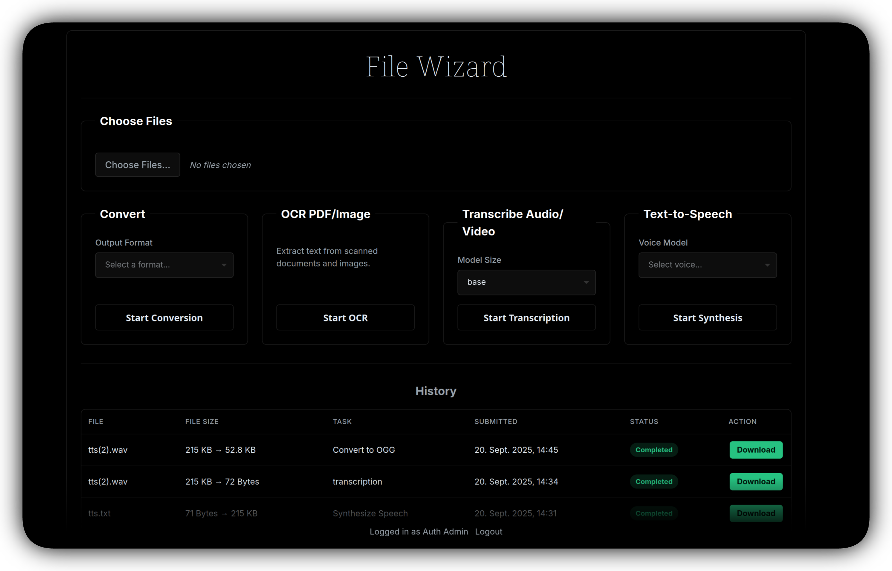

# File Wizard

[](https://www.paypal.me/unterrikermanu)
[](https://hub.docker.com/r/loredcast/filewizard)
[](https://hub.docker.com/r/loredcast/filewizard)

A self-hosted, browser-based utility for file conversion, OCR and audio transcription. It wraps common CLI and Python converters (FFmpeg, LibreOffice, Pandoc, ImageMagick, etc.), plus `faster-whisper` and Tesseract OCR.




## Features
- Convert between many file formats; extendable via `settings.yml` to add any CLI tool.
- OCR for PDFs and images (`tesseract` / `ocrmypdf`).
- Audio transcription using Whisper models.
- Simple, responsive dark UI with drag-and-drop and file picker.
- Background job processing with real-time status updates and persistent history.
- `/settings` page for configuring conversion tools and OAuth (runs without auth in local mode).
- OCR in many languages, selectable per job.
- Delete selected jobs, or remove finished jobs automatically after a number of days.
- CPU-only by default; a `cuda` image is available for GPU transcription. Images for amd64 and arm64.

## Security
**Warning:** in `LOCAL_ONLY` mode there is no login: everyone who can reach the port can use the app and change its settings. Keep it on a trusted network or enable OIDC authentication (`LOCAL_ONLY=False`). The converters process untrusted files, so run the container with only the volumes it needs.

Built-in protections:
- Requests that change state (uploads, settings, deletions) are only accepted from the app's own origin, so other websites you visit cannot drive your instance.
- Conversion command templates are read-only on the settings page. Edit `config/settings.yml`, or set `ALLOW_COMMAND_EDITS=true` to edit them in the browser.
- Secrets (OIDC client secret, webhook token) are never sent to the browser; leave the field empty to keep the stored value.
- `auth_settings.allowed_users` / `allowed_domains` restrict which accounts of your identity provider may log in (both empty = everyone the provider accepts).

| Variable | Default | Purpose |
|---|---|---|
| `SECRET_KEY` | generated, stored in `config/.secret_key` | Signs session cookies. |
| `SESSION_COOKIE_SECURE` | `false` | Set `true` when served over HTTPS. |
| `CSRF_TRUSTED_ORIGINS` | – | Extra origins (e.g. `https://files.example.com`) allowed to submit requests. Needed when a reverse proxy rewrites the `Host` header; setting `app_public_url` works too. |
| `ALLOWED_ORIGINS` | – | Origins granted CORS access (only needed for browser apps on other origins). |
| `ALLOWED_HOSTS` | – | Comma-separated host names the app answers to (protects `LOCAL_ONLY` instances against DNS rebinding). Include every name/IP you use, e.g. `localhost,127.0.0.1,nas.lan`. |
| `FRAME_ANCESTORS` | `'self'` | Who may embed the UI in a frame, e.g. `'self' https://dashboard.example.com`. |
| `ALLOW_COMMAND_EDITS` | `false` | Allow editing/adding conversion command templates on the settings page. |
| `CHILD_CPU_LIMIT_SECONDS` / `CHILD_MEMORY_LIMIT_MB` | `6000` / `4096` | Resource limits for converter processes (`0` disables the memory limit). |
| `STALE_UPLOAD_HOURS` | `6` | Abandoned chunked uploads are removed after this time. |

#### Tech stack
FastAPI, vanilla HTML/JS/CSS frontend.

## Installation
### Recommended — Docker (pull from Docker Hub)
Images (linux/amd64 and linux/arm64, e.g. Raspberry Pi 4/5 and Apple Silicon):
- `loredcast/filewizard:latest` — all tools
- `loredcast/filewizard:small` — without TeX, Inkscape and Docling
- `loredcast/filewizard:cuda` — transcription on NVIDIA GPUs (amd64 only)

Copy [`docker-compose.yml`](docker-compose.yml) from the repo, adjust as needed, then:

```bash
docker compose up -d
```
FileWizard will be available at `localhost:6969`. The app runs as an unprivileged user; set `PUID`/`PGID` to the owner of the mounted folders (Unraid: 99/100, templates in [`unraid/`](unraid)).

Building the image yourself, GPU setup, publishing to Docker Hub and how the builds are kept reproducible are described in [docs/docker.md](docs/docker.md).

**Upgrading from 0.4:** `docker compose pull && docker compose up -d` works with your existing setup. Read [the upgrade notes](docs/docker.md#upgrading-from-04) first: the app no longer runs as root, and you can keep your job history.

### Manual (no Docker)
Needs Python 3.12 and the converters you want to use on the `PATH` (LibreOffice, Pandoc, Ghostscript, Tesseract, FFmpeg, ...; see the Dockerfile for the full list).
```bash
git clone https://github.com/LoredCast/filewizard.git
cd filewizard
python3 -m venv venv
source venv/bin/activate   # Windows: venv\Scripts\activate
pip install -r requirements.txt   # or requirements_small.txt
./run.sh
```
To update: `git pull`, run the `pip install` line again and restart; settings and job history are kept.

## Configuration & docs
See the project Wiki for details and examples:  
https://github.com/LoredCast/filewizard/wiki

## Usage
1. Open `http://127.0.0.1:8000`.
2. Drag & drop or choose files.
3. Select action: Convert, OCR, or Transcribe.
4. Track job progress in the History table (updates automatically).

# Tools Table

| Tool | Common inputs (extensions / format names) | Common outputs (extensions / format names) | Notes |
|---|---|---|---|
| **LibreOffice (soffice)** | `.odt`, `.fodt`, `.ott`, `.doc`, `.docx`, `.docm`, `.dot`, `.dotx`, `.rtf`, `.txt`, `.html/.htm/.xhtml`, `.xml`, `.sxw`, `.wps`, `.wpd`, `.abw`, `.pdb`, `.epub`, `.fb2`, `.lit`, `.lrf`, `.pages`, `.csv`, `.tsv`, `.xls`, `.xlsx`, `.xlsm`, `.ods`, `.sxc`, `.123`, `.dbf`, `.fb2` | `.pdf`, `.pdfa`, `.odt`, `.fodt`, `.doc`, `.docx`, `.rtf`, `.txt`, `.html/.htm`, `.xhtml`, `.epub`, `.svg`, `.png`, `.jpg/.jpeg`, `.pptx`, `.ppt`, `.odp`, `.xls`, `.xlsx`, `.ods`, `.csv`, `.dbf`, `.pdb`, `.fb2` | Good for office/document conversions; fidelity varies with complex layouts. |
| **Pandoc** | Markdown flavors (`.md`, `.markdown`), `.html/.htm`, LaTeX (`.tex`), `.rst`, `.docx`, `.odt`, `.epub`, `.ipynb`, `.opml`, `.adoc`/asciidoc, `.tex`, `.bib`/citation inputs | `.html/.html5`, `.xhtml`, `.latex/.tex`, `.pdf` (via LaTeX engine), `.docx`, `.odt`, `.epub`, `.md` (flavors), `.gfm`, `.rst`, `.pptx`, `.man`, `.mediawiki`, `.docbook` | Highly configurable via templates/filters; requires LaTeX for PDF output. |
| **Ghostscript (gs)** | `.ps`, `.eps`, `.pdf`, PostScript streams | `.pdf` (various compat levels incl PDF/A), `.ps`, `.eps`, raster images (`.png`, `.jpg`, `.tiff`, `.bmp`, `.pnm`) | Useful for PDF manipulations, rasterization, and producing PDF/A. |
| **Calibre (ebook-convert)** | `.epub`, `.mobi`, `.azw3`, `.azw`, `.fb2`, `.html`, `.docx`, `.doc`, `.rtf`, `.txt`, `.pdb`, `.lit`, `.tcr`, `.cbz`, `.cbr`, `.odt`, `.pdf` (input with caveats) | `.epub`, `.mobi` (legacy), `.azw3`, `.pdf`, `.docx`, `.rtf`, `.txt`, `.fb2`, `.htmlz`, `.pdb`, `.lrf`, `.lit`, `.tcr`, `.cbz`, `.cbr` | Excellent for ebook format conversions and metadata handling; PDF input/output fidelity varies. |
| **FFmpeg** | Containers & codecs: `.mp4`, `.mkv`, `.mov`, `.avi`, `.webm`, `.flv`, `.wmv`, `.mpg/.mpeg`, `.ts`, `.m2ts`, `.3gp`, audio: `.mp3`, `.wav`, `.aac/.m4a`, `.flac`, `.ogg`, `.opus`, image sequences (`.png`, `.jpg`, `.tiff`), HLS (`.m3u8`) | Wide set: `.mp4`, `.mkv`, `.mov`, `.webm`, `.avi`, `.flv`, `.mp3`, `.aac/.m4a`, `.wav`, `.flac`, `.ogg`, `.opus`, `.gif` (animated), `.ts`, elementary streams, many codec/container combos | Extremely versatile — audio/video transcoding, extraction, container changes, filters. Supported formats depend on build flags and linked libraries. |
| **libvips (vips)** | `.jpg/.jpeg`, `.png`, `.tif/.tiff`, `.webp`, `.avif`, `.heif/.heic`, `.jp2`, `.gif` (frames), `.pnm`, `.fits`, `.exr`, PDF (via poppler delegate) | `.jpg/.jpeg`, `.png`, `.tif/.tiff`, `.webp`, `.avif`, `.heif`, `.jp2`, `.pnm`, `.v` (VIPS native), `.fits`, `.exr` | Fast, memory-efficient image processing; great for large images and tiling. |
| **GraphicsMagick (gm)** | `.jpg/.jpeg`, `.png`, `.gif`, `.tif/.tiff`, `.bmp`, `.ico`, `.eps`, `.pdf` (via Ghostscript/poppler), `.dpx`, `.pnm`, `.svg` (if delegate), `.webp` (if built), `.exr` | `.jpg/.jpeg`, `.png`, `.webp` (if enabled), `.tif/.tiff`, `.gif`, `.bmp`, `.pdf` (from images), `.eps`, `.ico`, `.xpm`, `.dpx` | Similar to ImageMagick but with different performance/behavior; supported formats depend on build/delegates. |
| **ImageMagick (convert / magick)** | Same as GraphicsMagick (large set; many delegates) | Same as GraphicsMagick | Often used interchangeably; watch for security considerations when processing untrusted images. |
| **Inkscape** | `.svg/.svgz`, `.pdf`, `.eps`, `.ps`, `.ai` (legacy imports), `.dxf`, raster images (`.png`, `.jpg`, `.jpeg`, `.gif`, `.tiff`, `.bmp`) | `.svg`, `.pdf`, `.ps`, `.eps`, `.png`, `.emf`, `.wmf`, `.xaml`, `.dxf`, `.eps` | Vector editing and export; CLI useful for batch SVG → PNG/PDF conversions. |
| **libjxl (cjxl / djxl)** | Raster inputs: `.png`, `.jpg/.jpeg`, `.ppm/.pbm/.pgm`, `.gif`, etc. | `.jxl` (JPEG XL) | Encoder/decoder for JPEG XL; availability depends on build. |
| **resvg** | `.svg/.svgz` | `.png` (raster) | Fast, accurate SVG renderer — good for SVG→PNG conversion. |
| **Potrace** | Bitmaps: `.pbm`, `.pgm`, `.ppm` (PNM family), `.bmp` (via conversion) | Vector: `.svg`, `.pdf`, `.eps`, `.ps`, `.dxf`, `.geojson` | Traces bitmaps to vector paths; often used with pre-conversion steps. |
| **Potrace GUI / autotrace alternatives** | — | — | Not included but sometimes available in toolchains; behavior varies. |
| **MarkItDown / markitdown** | `.pdf`, `.docx`, `.doc`, `.pptx`, `.ppt`, `.xlsx`, `.xls`, `.html`, `.eml`, `.msg`, `.md`, `.txt`, images, `.epub` | `.md` (Markdown) | Utility to extract/produce Markdown from various formats; implementation details vary. |
| **pngquant** | `.png` (truecolor/rgba) | `.png` (quantized palette PNG) | Lossy PNG quantization for smaller PNGs. |
| **MozJPEG (cjpeg, jpegtran)** | `.ppm/.pbm/.pgm` (PNM), `.bmp`, existing `.jpg` | `.jpg/.jpeg` (MozJPEG-optimized) | Produces smaller JPEGs with improved compression; good for recompression. |
| **SoX (Sound eXchange)** | `.wav`, `.aiff`, `.mp3` (if libmp3lame), `.flac`, `.ogg/.oga`, `.raw`, `.au`, `.voc`, `.w64`, `.gsm`, `.amr`, `.m4a` (if libs present) | `.wav`, `.aiff`, `.flac`, `.mp3`, `.ogg`, `.raw`, `.w64`, `.opus`, `.amr`, `.m4a` | Audio processing, normalization, effects; exact formats depend on linked libraries. |
| **Tesseract OCR / ocrmypdf** | Image formats (`.png`, `.jpg`, `.jpeg`, `.tiff`), PDFs (image PDFs) | Plain text (`.txt`), searchable PDF (PDF with text layer), HOCR, ALTO XML | OCR engine; language/training data required for best accuracy. `ocrmypdf` is a wrapper for PDF workflows. |
| **faster-whisper / OpenAI Whisper (local)** | Audio: `.mp3`, `.wav`, `.m4a`, `.flac`, `.ogg`, `.opus`, `.aac` | Plain text transcripts (`.txt`), `.srt`, `.vtt`, other subtitle formats | Local Whisper implementations for speech-to-text. Models and speed depend on CPU/GPU and model variant. |


Consider spending 30 seconds on the [» usage survey «](https://app.youform.com/forms/sdlb6mto) to help improve the app and suggest changes!


[](https://ko-fi.com/loredcast)
---
